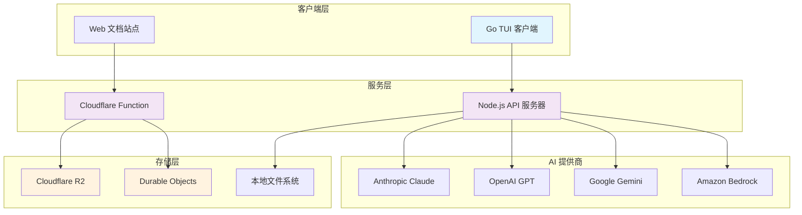
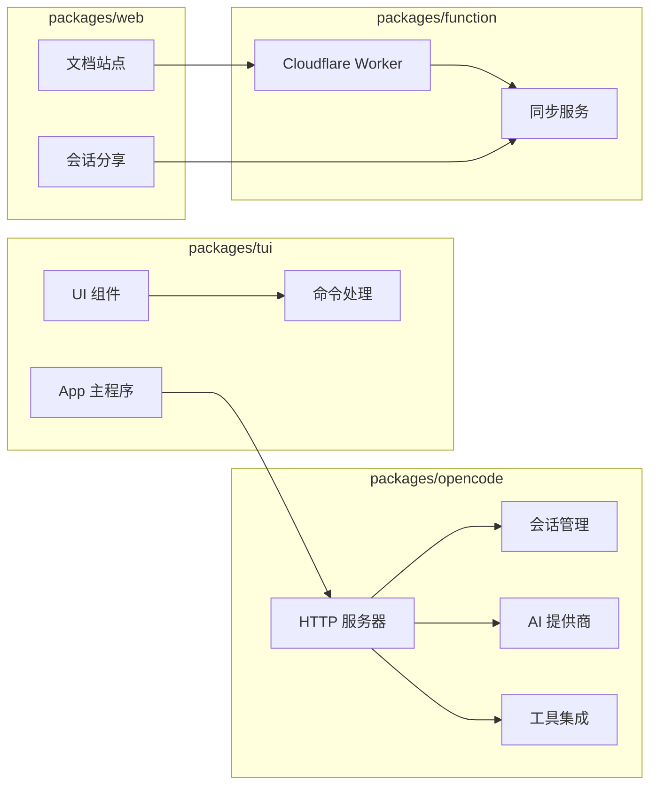
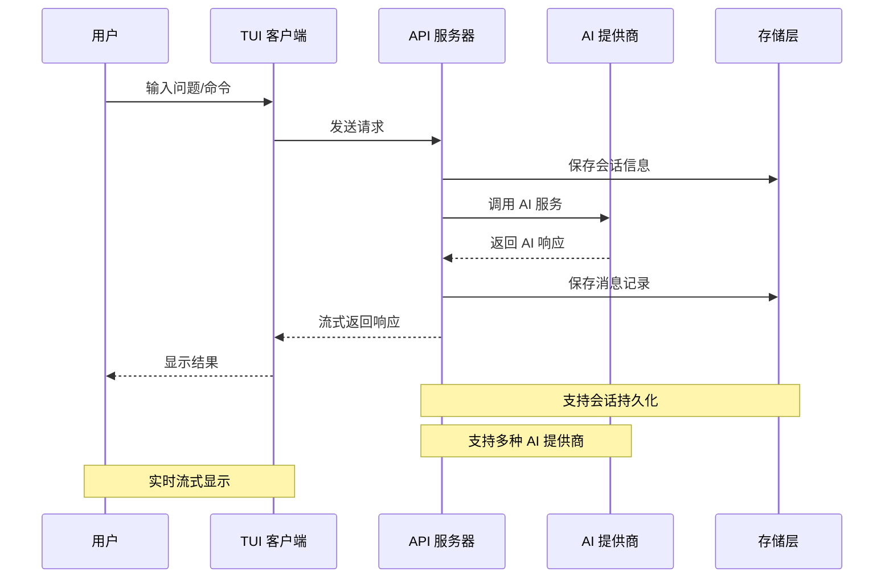
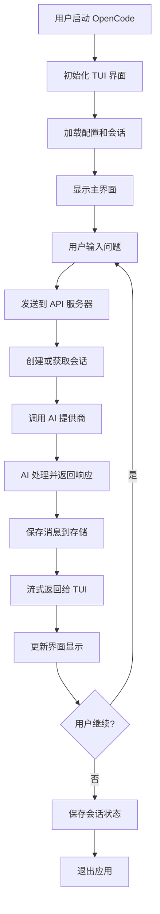
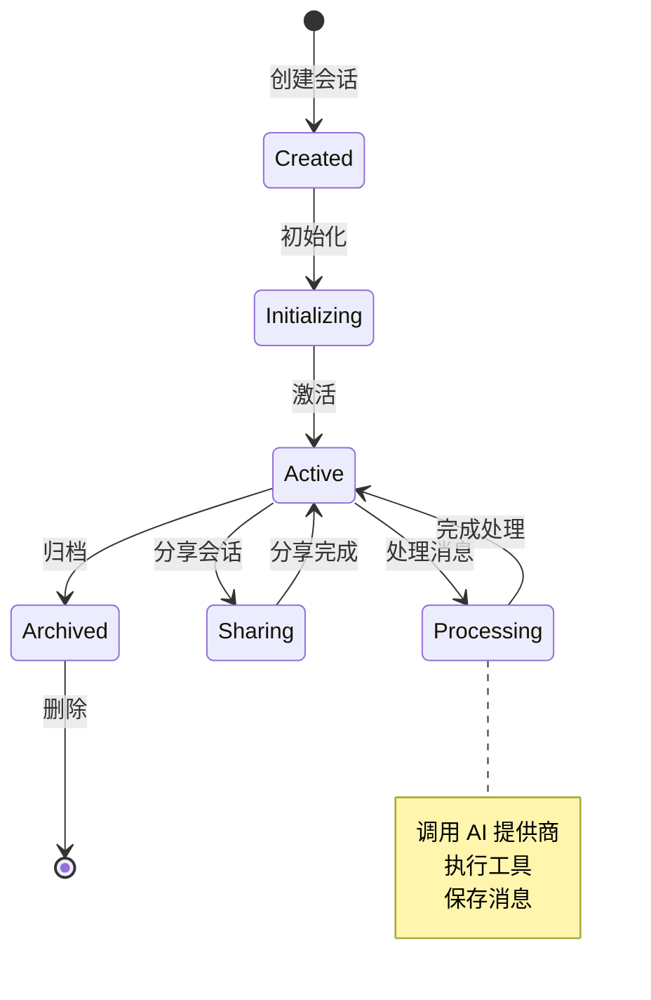
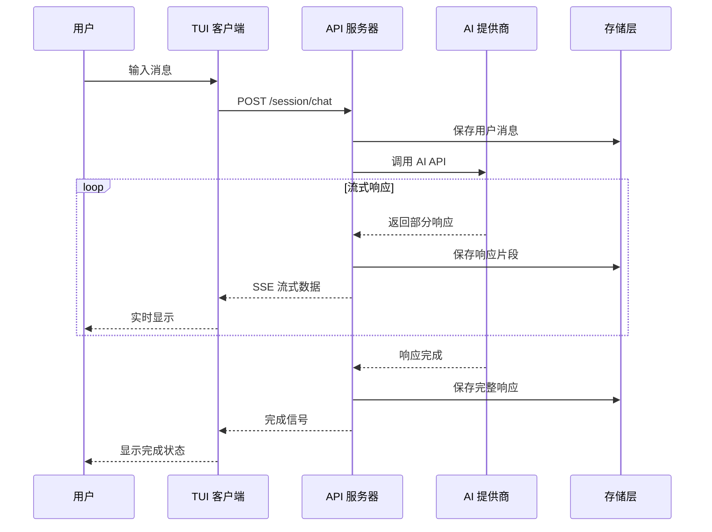
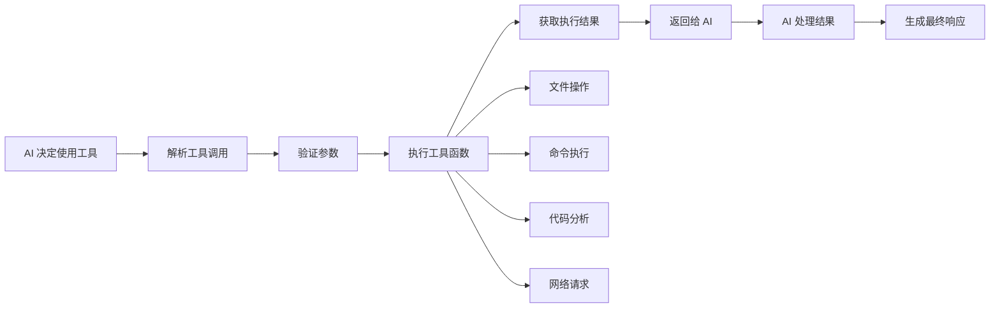

# OpenCode 技术文档

## 目录

- [项目概述](#项目概述)
- [技术栈说明](#技术栈说明)
- [项目架构设计](#项目架构设计)
- [目录结构详细说明](#目录结构详细说明)
- [安装和运行指南](#安装和运行指南)
- [API接口文档](#api接口文档)
- [核心功能模块详解](#核心功能模块详解)
- [数据流程说明](#数据流程说明)
- [配置文件说明](#配置文件说明)
- [开发指南和最佳实践](#开发指南和最佳实践)
- [常见问题和故障排除](#常见问题和故障排除)

## 项目概述

OpenCode 是一个基于终端的 AI 编程助手，旨在为开发者提供智能的代码生成、编辑和问答功能。它采用现代化的架构设计，支持多种 AI 提供商（如 Anthropic Claude、OpenAI GPT 等），并提供了直观的终端用户界面（TUI）。

### 主要功能特性

- **AI 驱动的代码助手**：支持代码生成、编辑、重构和问答
- **多 AI 提供商支持**：兼容 Anthropic、OpenAI、Google 等多个 AI 服务
- **终端用户界面**：基于 Go 语言构建的现代化 TUI 界面
- **会话管理**：支持多会话管理和会话共享功能
- **工具集成**：内置多种开发工具（bash、文件操作、LSP 等）
- **配置灵活**：支持自定义配置和主题
- **跨平台支持**：支持 macOS、Linux 和 Windows（通过 WSL）

### 项目特点

- **100% 开源**：完全开源，社区驱动
- **提供商无关**：不绑定特定 AI 提供商
- **客户端/服务器架构**：支持远程访问和多客户端
- **现代化技术栈**：使用最新的技术和工具

## 技术栈说明

### 前端技术栈

#### 终端用户界面 (TUI)
- **Go 1.24.x**：主要编程语言
- **Bubble Tea**：TUI 框架，用于构建交互式终端应用
- **Lip Gloss**：样式和布局库
- **Bubbles**：UI 组件库

#### Web 文档站点
- **Astro 5.7.13**：静态站点生成器
- **Solid.js 1.9.7**：响应式 UI 框架
- **Starlight**：文档主题
- **TypeScript 5.8.2**：类型安全的 JavaScript

### 后端技术栈

#### 核心服务
- **Bun**：JavaScript 运行时和包管理器
- **TypeScript 5.8.2**：主要开发语言
- **Hono 4.7.10**：轻量级 Web 框架
- **Zod 3.24.2**：数据验证和类型安全

#### AI 集成
- **AI SDK 4.3.16**：统一的 AI 提供商接口
- **多提供商支持**：Anthropic、OpenAI、Google、Amazon Bedrock 等

### 云基础设施

#### 部署平台
- **SST (Serverless Stack)**：基础设施即代码
- **Cloudflare Workers**：边缘计算平台
- **Cloudflare R2**：对象存储
- **Durable Objects**：状态管理和实时同步

### 开发工具

#### 包管理和构建
- **Bun 1.2.14**：包管理器和构建工具
- **Workspaces**：Monorepo 管理
- **TypeScript**：类型检查和编译

#### 代码质量
- **Prettier 3.5.3**：代码格式化
- **ESLint**：代码检查（通过配置）
- **Git Hooks**：自动化代码质量检查

## 项目架构设计

OpenCode 采用现代化的微服务架构，主要由以下几个核心组件组成：

### 系统架构图



### 组件关系图



### 数据流程图



## 目录结构详细说明

```
opencode/
├── packages/                    # Monorepo 包目录
│   ├── opencode/               # 核心 Node.js 服务
│   │   ├── src/               # 源代码目录
│   │   │   ├── app/           # 应用程序核心
│   │   │   ├── session/       # 会话管理
│   │   │   ├── provider/      # AI 提供商集成
│   │   │   ├── server/        # HTTP 服务器
│   │   │   ├── cli/           # 命令行接口
│   │   │   ├── util/          # 工具函数
│   │   │   └── index.ts       # 入口文件
│   │   ├── bin/               # 可执行文件
│   │   ├── script/            # 构建脚本
│   │   └── package.json       # 包配置
│   ├── tui/                   # Go TUI 客户端
│   │   ├── cmd/               # 命令行程序
│   │   ├── internal/          # 内部包
│   │   │   ├── app/           # 应用逻辑
│   │   │   ├── tui/           # TUI 实现
│   │   │   ├── components/    # UI 组件
│   │   │   ├── commands/      # 命令处理
│   │   │   └── theme/         # 主题系统
│   │   ├── pkg/               # 公共包
│   │   ├── go.mod             # Go 模块文件
│   │   └── go.sum             # 依赖锁定文件
│   ├── function/              # Cloudflare Function
│   │   ├── src/               # 源代码
│   │   │   └── api.ts         # API 实现
│   │   └── package.json       # 包配置
│   └── web/                   # Web 文档站点
│       ├── src/               # 源代码
│       │   ├── content/       # 文档内容
│       │   ├── components/    # Astro 组件
│       │   └── assets/        # 静态资源
│       ├── astro.config.mjs   # Astro 配置
│       └── package.json       # 包配置
├── infra/                     # 基础设施配置
│   └── app.ts                 # SST 应用配置
├── scripts/                   # 构建和部署脚本
├── patches/                   # 依赖补丁
├── sst.config.ts             # SST 配置文件
├── package.json              # 根包配置
├── bun.lock                  # 依赖锁定文件
└── README.md                 # 项目说明
```

### 核心目录说明

#### packages/opencode
这是项目的核心服务，使用 TypeScript 和 Bun 构建：
- **src/app/**: 应用程序的核心逻辑，包括应用状态管理和初始化
- **src/session/**: 会话管理模块，处理用户会话的创建、更新和持久化
- **src/provider/**: AI 提供商集成，支持多种 AI 服务的统一接口
- **src/server/**: HTTP 服务器实现，提供 RESTful API 和 SSE 流式接口
- **src/cli/**: 命令行接口，支持各种 CLI 命令

#### packages/tui
Go 语言实现的终端用户界面：
- **internal/tui/**: TUI 的主要实现，基于 Bubble Tea 框架
- **internal/components/**: 可复用的 UI 组件（聊天、状态栏、对话框等）
- **internal/app/**: 应用程序逻辑和状态管理
- **pkg/**: 公共包和客户端 SDK

#### packages/function
Cloudflare Worker 函数：
- **src/api.ts**: 实现会话同步和分享功能的 API

#### packages/web
基于 Astro 的文档网站：
- **src/content/**: Markdown 格式的文档内容
- **src/components/**: Astro 和 Solid.js 组件

## 安装和运行指南

### 环境要求

#### 系统要求
- **操作系统**: macOS, Linux, 或 Windows (通过 WSL)
- **内存**: 至少 4GB RAM
- **存储**: 至少 1GB 可用空间

#### 软件依赖
- **Bun**: 1.2.14 或更高版本
- **Go**: 1.24.x 或更高版本
- **Node.js**: 18.x 或更高版本（可选，Bun 可替代）
- **Git**: 用于版本控制

### 快速安装

#### 方式一：一键安装脚本（推荐）
```bash
# 使用官方安装脚本
curl -fsSL https://opencode.ai/install | bash
```

#### 方式二：包管理器安装
```bash
# npm/yarn/pnpm
npm i -g opencode-ai@latest
# 或
yarn global add opencode-ai@latest
# 或
pnpm add -g opencode-ai@latest

# Homebrew (macOS)
brew install sst/tap/opencode

# Arch Linux
paru -S opencode-bin
```

### 开发环境搭建

#### 1. 克隆项目
```bash
git clone https://github.com/sst/opencode.git
cd opencode
```

#### 2. 安装依赖
```bash
# 安装所有依赖
bun install
```

#### 3. 配置环境
```bash
# 复制环境配置文件
cp .env.example .env

# 编辑配置文件，添加必要的 API 密钥
vim .env
```

#### 4. 启动开发服务器
```bash
# 启动核心服务
bun run packages/opencode/src/index.ts

# 或者使用开发脚本
bun run dev
```

### 生产环境部署

#### 使用 SST 部署到 Cloudflare
```bash
# 安装 SST CLI
npm install -g sst

# 部署到开发环境
sst deploy --stage dev

# 部署到生产环境
sst deploy --stage production
```

### 验证安装

安装完成后，可以通过以下命令验证：

```bash
# 检查版本
opencode --version

# 查看帮助信息
opencode --help

# 启动 TUI 界面
opencode
```

## API接口文档

OpenCode 提供了完整的 RESTful API 和 Server-Sent Events (SSE) 接口，用于与 TUI 客户端和其他应用程序集成。

### 基础信息

- **Base URL**: `http://localhost:PORT` (开发环境) 或 `https://api.opencode.ai` (生产环境)
- **API 版本**: v1
- **认证方式**: API Key (通过 Header 或环境变量)
- **数据格式**: JSON
- **流式响应**: Server-Sent Events (SSE)

### 核心 API 端点

#### 1. 应用信息
```http
GET /app/info
```
获取应用程序基本信息，包括版本、路径配置等。

**响应示例**:
```json
{
  "user": "username",
  "git": true,
  "path": {
    "config": "/path/to/config",
    "data": "/path/to/data", 
    "root": "/path/to/project",
    "cwd": "/current/working/dir",
    "state": "/path/to/state"
  },
  "time": {
    "initialized": 1640995200000
  }
}
```

#### 2. 配置管理
```http
POST /config/get
```
获取当前配置信息。

```http
POST /config/set
Content-Type: application/json

{
  "theme": "dark",
  "model": "anthropic/claude-3-sonnet",
  "autoshare": false
}
```

#### 3. 提供商管理
```http
GET /provider/list
```
获取所有可用的 AI 提供商列表。

```http
GET /provider/{providerId}/models
```
获取指定提供商的模型列表。

#### 4. 会话管理
```http
POST /session/create
Content-Type: application/json

{
  "parentID": "optional-parent-session-id"
}
```

```http
GET /session/list
```
获取所有会话列表。

```http
POST /session/initialize
Content-Type: application/json

{
  "sessionID": "session-id",
  "providerID": "anthropic", 
  "modelID": "claude-3-sonnet"
}
```

#### 5. 消息处理
```http
POST /session/chat
Content-Type: application/json

{
  "sessionID": "session-id",
  "providerID": "anthropic",
  "modelID": "claude-3-sonnet", 
  "parts": [
    {
      "type": "text",
      "text": "Hello, how can you help me?"
    }
  ]
}
```

**SSE 流式响应**:
```
data: {"type":"text","content":"Hello! I'm here to help you with coding tasks..."}

data: {"type":"tool_call","name":"read_file","arguments":{"path":"src/main.ts"}}

data: {"type":"tool_result","content":"File content here..."}

data: {"type":"finish","usage":{"tokens":150}}
```

### 工具 API

OpenCode 内置了多种开发工具，通过 API 可以直接调用：

#### 文件操作
- `read_file`: 读取文件内容
- `write_file`: 写入文件
- `list_files`: 列出目录内容
- `glob_search`: 全局文件搜索

#### 代码分析
- `lsp_diagnostic`: LSP 诊断信息
- `lsp_hover`: LSP 悬停信息
- `grep_search`: 代码搜索

#### 系统操作
- `bash_execute`: 执行 bash 命令
- `patch_apply`: 应用代码补丁

### 错误处理

API 使用标准的 HTTP 状态码：

- `200`: 成功
- `400`: 请求错误
- `401`: 未授权
- `404`: 资源不存在
- `500`: 服务器内部错误

错误响应格式：
```json
{
  "error": {
    "code": "INVALID_REQUEST",
    "message": "详细错误信息",
    "details": {}
  }
}
```

### 认证和安全

#### API Key 配置
```bash
# 通过环境变量
export ANTHROPIC_API_KEY="your-api-key"
export OPENAI_API_KEY="your-api-key"

# 或通过 CLI 配置
opencode auth login
```

#### 请求限制
- 每分钟最多 100 个请求
- 单个会话最多 1000 条消息
- 文件上传最大 10MB

### SDK 和客户端

#### Go 客户端
```go
import "github.com/sst/opencode/pkg/client"

client, err := client.NewClientWithResponses("http://localhost:8080")
if err != nil {
    log.Fatal(err)
}

response, err := client.PostSessionCreateWithResponse(ctx)
```

#### TypeScript 客户端
```typescript
import { OpenCodeClient } from 'opencode-client'

const client = new OpenCodeClient({
  baseURL: 'http://localhost:8080'
})

const session = await client.createSession()
```

## 核心功能模块详解

### 1. 会话管理模块 (Session Management)

会话管理是 OpenCode 的核心功能之一，负责管理用户与 AI 的对话会话。

#### 主要功能
- **会话创建和销毁**：支持创建新会话和清理旧会话
- **消息持久化**：所有对话消息都会保存到本地存储
- **会话共享**：支持将会话分享给其他用户
- **父子会话**：支持从现有会话创建子会话

#### 核心代码结构
```typescript
// packages/opencode/src/session/index.ts
export namespace Session {
  export interface Info {
    id: string
    version: string
    parentID?: string
    title: string
    time: {
      created: number
      updated: number
    }
    share?: ShareInfo
  }

  export async function create(parentID?: string): Promise<Info>
  export async function chat(input: ChatInput): Promise<void>
  export async function initialize(input: InitializeInput): Promise<void>
}
```

#### 使用示例
```typescript
// 创建新会话
const session = await Session.create()

// 发送消息
await Session.chat({
  sessionID: session.id,
  providerID: 'anthropic',
  modelID: 'claude-3-sonnet',
  parts: [{ type: 'text', text: 'Hello!' }]
})
```

### 2. AI 提供商集成模块 (Provider Integration)

该模块负责集成多种 AI 服务提供商，提供统一的接口。

#### 支持的提供商
- **Anthropic**: Claude 系列模型
- **OpenAI**: GPT 系列模型
- **Google**: Gemini 系列模型
- **Amazon Bedrock**: 多种模型
- **自定义提供商**: 支持通过配置添加

#### 配置示例
```json
{
  "provider": {
    "anthropic": {
      "apiKey": "your-api-key",
      "models": {
        "claude-3-sonnet": {
          "name": "Claude 3 Sonnet",
          "temperature": 0
        }
      }
    }
  }
}
```

#### 核心实现
```typescript
// packages/opencode/src/provider/provider.ts
export namespace Provider {
  export async function list(): Promise<ProviderInfo[]>
  export async function models(providerID: string): Promise<ModelInfo[]>
  export async function tools(providerID: string): Promise<Tool[]>
}
```

### 3. 工具系统 (Tool System)

OpenCode 内置了丰富的工具集，让 AI 能够执行各种开发任务。

#### 内置工具列表
- **文件操作工具**
  - `read_file`: 读取文件内容
  - `write_file`: 写入文件
  - `list_files`: 列出目录
  - `glob_search`: 文件搜索

- **代码分析工具**
  - `lsp_diagnostic`: LSP 诊断
  - `lsp_hover`: 代码悬停信息
  - `grep_search`: 代码搜索

- **系统工具**
  - `bash_execute`: 执行命令
  - `patch_apply`: 应用补丁

#### 工具定义示例
```typescript
const ReadTool: Tool.Info = {
  id: 'read_file',
  name: 'read_file',
  description: '读取文件内容',
  parameters: z.object({
    path: z.string().describe('文件路径')
  }),
  handler: async ({ path }) => {
    const content = await Bun.file(path).text()
    return { content }
  }
}
```

### 4. TUI 界面模块 (Terminal User Interface)

基于 Go 和 Bubble Tea 框架构建的现代化终端界面。

#### 主要组件
- **消息组件**: 显示对话历史
- **编辑器组件**: 用户输入区域
- **状态栏组件**: 显示当前状态
- **模态对话框**: 各种交互对话框

#### 组件架构
```go
// packages/tui/internal/tui/tui.go
type appModel struct {
    width, height        int
    app                  *app.App
    modal                layout.Modal
    status               status.StatusComponent
    editor               chat.EditorComponent
    messages             chat.MessagesComponent
    layout               layout.FlexLayout
}
```

#### 事件处理
```go
func (a appModel) Update(msg tea.Msg) (tea.Model, tea.Cmd) {
    switch msg := msg.(type) {
    case tea.KeyPressMsg:
        // 处理键盘输入
    case tea.WindowSizeMsg:
        // 处理窗口大小变化
    case app.SessionSelectedMsg:
        // 处理会话选择
    }
    return a, nil
}
```

### 5. 配置管理模块 (Configuration Management)

负责管理应用程序的各种配置选项。

#### 配置文件结构
```json
{
  "$schema": "https://opencode.ai/config.json",
  "provider": {
    "anthropic": {
      "apiKey": "your-api-key"
    }
  },
  "theme": "dark",
  "model": "anthropic/claude-3-sonnet",
  "autoshare": false,
  "keybinds": {
    "leader": "ctrl+x"
  },
  "mcp": {
    "server-name": {
      "type": "local",
      "command": ["python", "server.py"]
    }
  }
}
```

#### 配置加载
```typescript
// packages/opencode/src/config/config.ts
export namespace Config {
  export async function get(): Promise<ConfigInfo>
  export async function set(config: Partial<ConfigInfo>): Promise<void>
  export async function validate(config: unknown): Promise<ConfigInfo>
}
```

### 6. 存储模块 (Storage Module)

负责数据的持久化存储和管理。

#### 存储类型
- **本地文件存储**: 会话数据、配置文件
- **云端存储**: Cloudflare R2 用于会话分享
- **内存存储**: 临时数据和缓存

#### 存储接口
```typescript
// packages/opencode/src/storage/storage.ts
export namespace Storage {
  export async function writeJSON(key: string, data: any): Promise<void>
  export async function readJSON<T>(key: string): Promise<T | undefined>
  export async function delete(key: string): Promise<void>
  export async function list(prefix: string): Promise<string[]>
}
```

## 数据流程说明

### 用户交互流程



### 会话生命周期



### 消息处理流程



### 工具执行流程



## 配置文件说明

### 主配置文件 (opencode.json)

OpenCode 使用 JSON 格式的配置文件，通常位于用户配置目录中。

#### 完整配置示例
```json
{
  "$schema": "https://opencode.ai/config.json",
  "provider": {
    "anthropic": {
      "npm": "@ai-sdk/anthropic",
      "name": "Anthropic",
      "options": {
        "apiKey": "your-anthropic-api-key"
      },
      "models": {
        "claude-3-sonnet": {
          "name": "Claude 3 Sonnet",
          "temperature": 0
        },
        "claude-3-haiku": {
          "name": "Claude 3 Haiku",
          "temperature": 0.3
        }
      }
    },
    "openai": {
      "npm": "@ai-sdk/openai",
      "name": "OpenAI",
      "options": {
        "apiKey": "your-openai-api-key"
      },
      "models": {
        "gpt-4": {
          "name": "GPT-4"
        },
        "gpt-3.5-turbo": {
          "name": "GPT-3.5 Turbo"
        }
      }
    }
  },
  "theme": "dark",
  "model": "anthropic/claude-3-sonnet",
  "autoshare": false,
  "keybinds": {
    "leader": "ctrl+x",
    "send": "ctrl+enter",
    "new_session": "ctrl+n",
    "quit": "ctrl+q"
  },
  "mcp": {
    "filesystem": {
      "type": "local",
      "command": ["python", "-m", "mcp_server_filesystem"],
      "environment": {
        "PATH": "/usr/local/bin:/usr/bin:/bin"
      }
    },
    "web_search": {
      "type": "remote",
      "url": "https://api.example.com/mcp"
    }
  },
  "tool": {
    "provider": {
      "anthropic": ["read_file", "write_file", "bash_execute"],
      "openai": ["read_file", "write_file", "list_files"]
    }
  }
}
```

#### 配置项详解

##### 1. Provider 配置
```json
{
  "provider": {
    "provider-id": {
      "npm": "npm-package-name",     // NPM 包名
      "name": "显示名称",              // 用户友好的名称
      "options": {                   // 提供商选项
        "apiKey": "api-key",         // API 密钥
        "baseURL": "custom-url"      // 自定义 API 端点
      },
      "models": {                    // 支持的模型
        "model-id": {
          "name": "模型显示名称",
          "temperature": 0.7         // 模型参数
        }
      }
    }
  }
}
```

##### 2. 主题配置
```json
{
  "theme": "dark",  // 可选值: "dark", "light", "auto"
}
```

##### 3. 默认模型
```json
{
  "model": "provider-id/model-id"  // 格式: 提供商ID/模型ID
}
```

##### 4. 键盘绑定
```json
{
  "keybinds": {
    "leader": "ctrl+x",        // 领导键
    "send": "ctrl+enter",      // 发送消息
    "new_session": "ctrl+n",   // 新建会话
    "quit": "ctrl+q",          // 退出应用
    "copy": "ctrl+c",          // 复制
    "paste": "ctrl+v"          // 粘贴
  }
}
```

##### 5. MCP 服务器配置
```json
{
  "mcp": {
    "server-name": {
      "type": "local",                    // 类型: local 或 remote
      "command": ["python", "server.py"], // 本地命令
      "environment": {                    // 环境变量
        "API_KEY": "your-key"
      }
    },
    "remote-server": {
      "type": "remote",
      "url": "https://api.example.com/mcp"  // 远程 URL
    }
  }
}
```

### 环境变量配置

OpenCode 支持通过环境变量进行配置：

```bash
# API 密钥
export ANTHROPIC_API_KEY="your-anthropic-key"
export OPENAI_API_KEY="your-openai-key"
export GOOGLE_API_KEY="your-google-key"

# AWS 配置 (用于 Bedrock)
export AWS_PROFILE="your-profile"
export AWS_REGION="us-east-1"

# 应用配置
export OPENCODE_THEME="dark"
export OPENCODE_MODEL="anthropic/claude-3-sonnet"
export OPENCODE_AUTO_SHARE="false"

# 调试配置
export OPENCODE_LOG_LEVEL="debug"
export OPENCODE_LOG_FILE="/path/to/log/file"
```

### 配置文件位置

OpenCode 按以下优先级查找配置文件：

1. **当前目录**: `./opencode.json`
2. **项目根目录**: `./opencode.json` (Git 仓库根目录)
3. **用户配置目录**:
   - macOS: `~/Library/Application Support/opencode/config.json`
   - Linux: `~/.config/opencode/config.json`
   - Windows: `%APPDATA%/opencode/config.json`

### 配置验证

OpenCode 使用 Zod 进行配置验证：

```typescript
// 配置验证示例
const config = await Config.validate({
  provider: {
    anthropic: {
      apiKey: "invalid-key"  // 这会触发验证错误
    }
  }
})
```

### 配置管理命令

```bash
# 查看当前配置
opencode config show

# 设置配置项
opencode config set theme dark
opencode config set model anthropic/claude-3-sonnet

# 验证配置
opencode config validate

# 重置配置
opencode config reset
```

## 开发指南和最佳实践

### 开发环境设置

#### 1. 开发工具推荐
- **IDE**: VS Code 或 GoLand
- **终端**: iTerm2 (macOS) 或 Windows Terminal
- **Git 客户端**: 命令行或 GitHub Desktop
- **调试工具**: Bun 内置调试器、Go Delve

#### 2. VS Code 扩展推荐
```json
{
  "recommendations": [
    "golang.go",                    // Go 语言支持
    "oven.bun-vscode",             // Bun 支持
    "bradlc.vscode-tailwindcss",   // Tailwind CSS
    "astro-build.astro-vscode",    // Astro 支持
    "ms-vscode.vscode-typescript-next"
  ]
}
```

#### 3. 开发环境配置
```bash
# 设置 Go 环境
export GOPATH=$HOME/go
export PATH=$PATH:$GOPATH/bin

# 安装 Go 工具
go install github.com/go-delve/delve/cmd/dlv@latest

# 设置 Bun 环境
export BUN_INSTALL="$HOME/.bun"
export PATH="$BUN_INSTALL/bin:$PATH"
```

### 代码规范和风格

#### TypeScript/JavaScript 规范
```typescript
// 使用 TypeScript 严格模式
// tsconfig.json
{
  "compilerOptions": {
    "strict": true,
    "noImplicitAny": true,
    "noImplicitReturns": true
  }
}

// 命名规范
export namespace MyNamespace {  // PascalCase for namespaces
  export interface UserInfo {   // PascalCase for interfaces
    userId: string              // camelCase for properties
    userName: string
  }

  export async function createUser(info: UserInfo) {  // camelCase for functions
    const API_ENDPOINT = '/api/users'  // UPPER_CASE for constants
    // ...
  }
}
```

#### Go 代码规范
```go
// 包命名使用小写
package main

// 结构体使用 PascalCase
type UserInfo struct {
    UserID   string `json:"userId"`   // 导出字段
    userName string `json:"userName"` // 私有字段
}

// 方法命名
func (u *UserInfo) GetUserName() string {  // 导出方法
    return u.userName
}

func (u *UserInfo) setUserName(name string) {  // 私有方法
    u.userName = name
}

// 错误处理
func CreateUser(info UserInfo) (*UserInfo, error) {
    if info.UserID == "" {
        return nil, fmt.Errorf("user ID cannot be empty")
    }
    // ...
    return &info, nil
}
```

### 项目结构最佳实践

#### 1. 模块化设计
```
packages/opencode/src/
├── app/           # 应用核心逻辑
├── session/       # 会话管理
├── provider/      # AI 提供商
├── server/        # HTTP 服务器
├── util/          # 工具函数
└── types/         # 类型定义
```

#### 2. 依赖管理
```json
// package.json - 使用 workspace catalog
{
  "workspaces": {
    "catalog": {
      "typescript": "5.8.2",
      "zod": "3.24.2"
    }
  }
}

// 在子包中引用
{
  "dependencies": {
    "typescript": "catalog:",
    "zod": "catalog:"
  }
}
```

#### 3. 错误处理模式
```typescript
// 自定义错误类
export class OpenCodeError extends Error {
  constructor(
    message: string,
    public readonly code: string,
    public readonly details?: any
  ) {
    super(message)
    this.name = 'OpenCodeError'
  }
}

// 错误处理函数
export function handleError(error: unknown): OpenCodeError {
  if (error instanceof OpenCodeError) {
    return error
  }

  if (error instanceof Error) {
    return new OpenCodeError(error.message, 'UNKNOWN_ERROR')
  }

  return new OpenCodeError('Unknown error occurred', 'UNKNOWN_ERROR')
}
```

### 测试策略

#### 1. 单元测试
```typescript
// 使用 Bun 内置测试框架
import { test, expect } from 'bun:test'
import { Session } from '../src/session'

test('should create session with valid ID', async () => {
  const session = await Session.create()

  expect(session.id).toBeDefined()
  expect(session.id).toMatch(/^session_/)
  expect(session.time.created).toBeGreaterThan(0)
})

test('should handle invalid session ID', async () => {
  expect(async () => {
    await Session.get('invalid-id')
  }).toThrow('Session not found')
})
```

#### 2. 集成测试
```go
// Go 测试示例
func TestTUIIntegration(t *testing.T) {
    // 创建测试应用
    app := createTestApp(t)

    // 创建 TUI 模型
    model := tui.NewModel(app)

    // 模拟用户输入
    msg := tea.KeyPressMsg{Type: tea.KeyRunes, Runes: []rune("hello")}

    // 更新模型
    newModel, cmd := model.Update(msg)

    // 验证结果
    assert.NotNil(t, newModel)
    assert.NotNil(t, cmd)
}
```

#### 3. 端到端测试
```bash
#!/bin/bash
# e2e-test.sh

# 启动测试服务器
bun run packages/opencode/src/index.ts &
SERVER_PID=$!

# 等待服务器启动
sleep 2

# 运行 TUI 测试
go test ./packages/tui/... -tags=e2e

# 清理
kill $SERVER_PID
```

### 性能优化

#### 1. 内存管理
```typescript
// 使用对象池减少 GC 压力
class MessagePool {
  private pool: Message[] = []

  acquire(): Message {
    return this.pool.pop() || new Message()
  }

  release(message: Message) {
    message.reset()
    this.pool.push(message)
  }
}
```

#### 2. 流式处理
```typescript
// 使用 AsyncIterator 处理大数据
async function* processLargeFile(filePath: string) {
  const file = Bun.file(filePath)
  const stream = file.stream()
  const reader = stream.getReader()

  try {
    while (true) {
      const { done, value } = await reader.read()
      if (done) break
      yield value
    }
  } finally {
    reader.releaseLock()
  }
}
```

#### 3. 缓存策略
```typescript
// LRU 缓存实现
class LRUCache<K, V> {
  private cache = new Map<K, V>()

  constructor(private maxSize: number) {}

  get(key: K): V | undefined {
    const value = this.cache.get(key)
    if (value !== undefined) {
      // 移到最前面
      this.cache.delete(key)
      this.cache.set(key, value)
    }
    return value
  }

  set(key: K, value: V): void {
    if (this.cache.has(key)) {
      this.cache.delete(key)
    } else if (this.cache.size >= this.maxSize) {
      // 删除最旧的项
      const firstKey = this.cache.keys().next().value
      this.cache.delete(firstKey)
    }
    this.cache.set(key, value)
  }
}
```

### 安全最佳实践

#### 1. API 密钥管理
```typescript
// 安全的 API 密钥处理
export class SecureConfig {
  private static encryptKey(key: string): string {
    // 使用系统密钥库或加密存储
    return encrypt(key, getSystemKey())
  }

  private static decryptKey(encryptedKey: string): string {
    return decrypt(encryptedKey, getSystemKey())
  }

  static async storeApiKey(provider: string, key: string) {
    const encrypted = this.encryptKey(key)
    await Storage.writeJSON(`auth/${provider}`, { key: encrypted })
  }
}
```

#### 2. 输入验证
```typescript
// 使用 Zod 进行严格验证
const UserInputSchema = z.object({
  message: z.string().min(1).max(10000),
  sessionId: z.string().uuid(),
  providerId: z.enum(['anthropic', 'openai', 'google'])
})

export function validateUserInput(input: unknown) {
  return UserInputSchema.parse(input)
}
```

#### 3. 权限控制
```typescript
// 文件访问权限检查
export async function safeFileRead(path: string): Promise<string> {
  const resolvedPath = path.resolve(path)
  const projectRoot = App.info().path.root

  // 确保文件在项目目录内
  if (!resolvedPath.startsWith(projectRoot)) {
    throw new Error('Access denied: file outside project directory')
  }

  return Bun.file(resolvedPath).text()
}
```

### 调试和日志

#### 1. 结构化日志
```typescript
// 使用结构化日志
import { Log } from './util/log'

const log = Log.create({ service: 'session' })

export async function createSession(parentID?: string) {
  log.info('creating session', { parentID })

  try {
    const session = await doCreateSession(parentID)
    log.info('session created', {
      sessionId: session.id,
      parentID,
      duration: Date.now() - startTime
    })
    return session
  } catch (error) {
    log.error('failed to create session', {
      parentID,
      error: error.message,
      stack: error.stack
    })
    throw error
  }
}
```

#### 2. 调试配置
```json
// .vscode/launch.json
{
  "version": "0.2.0",
  "configurations": [
    {
      "name": "Debug OpenCode Server",
      "type": "bun",
      "request": "launch",
      "program": "packages/opencode/src/index.ts",
      "env": {
        "OPENCODE_LOG_LEVEL": "debug"
      }
    },
    {
      "name": "Debug TUI",
      "type": "go",
      "request": "launch",
      "mode": "debug",
      "program": "packages/tui/cmd/opencode",
      "env": {
        "OPENCODE_SERVER": "http://localhost:8080"
      }
    }
  ]
}
```

### 部署和发布

#### 1. 构建脚本
```bash
#!/bin/bash
# build.sh

set -e

echo "Building OpenCode..."

# 构建 TypeScript 项目
echo "Building TypeScript packages..."
bun run typecheck
bun run build

# 构建 Go TUI
echo "Building Go TUI..."
cd packages/tui
go build -o ../../dist/opencode ./cmd/opencode
cd ../..

# 构建 Web 文档
echo "Building web documentation..."
cd packages/web
bun run build
cd ../..

echo "Build completed successfully!"
```

#### 2. 发布流程
```yaml
# .github/workflows/release.yml
name: Release
on:
  push:
    tags: ['v*']

jobs:
  release:
    runs-on: ubuntu-latest
    steps:
      - uses: actions/checkout@v4
      - uses: oven-sh/setup-bun@v1
      - uses: actions/setup-go@v4
        with:
          go-version: '1.24'

      - name: Install dependencies
        run: bun install

      - name: Run tests
        run: bun test

      - name: Build binaries
        run: ./scripts/build.sh

      - name: Create release
        uses: softprops/action-gh-release@v1
        with:
          files: dist/*
```

## 常见问题和故障排除

### 安装问题

#### Q1: 安装时提示权限错误
**问题**: `Permission denied` 或 `EACCES` 错误

**解决方案**:
```bash
# 方法1: 使用 sudo (不推荐)
sudo npm install -g opencode-ai

# 方法2: 配置 npm 全局目录 (推荐)
mkdir ~/.npm-global
npm config set prefix '~/.npm-global'
echo 'export PATH=~/.npm-global/bin:$PATH' >> ~/.bashrc
source ~/.bashrc
npm install -g opencode-ai

# 方法3: 使用 Homebrew (macOS)
brew install sst/tap/opencode
```

#### Q2: Bun 安装失败
**问题**: Bun 安装或运行时出错

**解决方案**:
```bash
# 重新安装 Bun
curl -fsSL https://bun.sh/install | bash

# 检查 Bun 版本
bun --version

# 如果版本过低，升级 Bun
bun upgrade

# 清理缓存
bun pm cache rm
```

#### Q3: Go 版本不兼容
**问题**: Go 版本过低导致编译失败

**解决方案**:
```bash
# 检查 Go 版本
go version

# 升级 Go (使用 g 工具)
curl -sSL https://git.io/g-install | sh -s
g install 1.24.0

# 或者从官网下载
# https://golang.org/dl/
```

### 运行时问题

#### Q4: 无法连接到 AI 提供商
**问题**: API 调用失败或超时

**诊断步骤**:
```bash
# 1. 检查网络连接
curl -I https://api.anthropic.com
curl -I https://api.openai.com

# 2. 验证 API 密钥
opencode auth list

# 3. 测试 API 调用
curl -H "Authorization: Bearer YOUR_API_KEY" \
     -H "Content-Type: application/json" \
     https://api.anthropic.com/v1/messages
```

**解决方案**:
```bash
# 重新配置 API 密钥
opencode auth login

# 检查代理设置
export HTTP_PROXY=http://proxy.example.com:8080
export HTTPS_PROXY=http://proxy.example.com:8080

# 使用自定义端点
opencode config set provider.anthropic.baseURL "https://custom-endpoint.com"
```

#### Q5: TUI 界面显示异常
**问题**: 界面乱码、颜色错误或布局问题

**解决方案**:
```bash
# 1. 检查终端兼容性
echo $TERM
export TERM=xterm-256color

# 2. 重置主题
opencode config set theme auto

# 3. 清理状态文件
rm -rf ~/.config/opencode/state/

# 4. 使用兼容模式
OPENCODE_COMPAT_MODE=true opencode
```

#### Q6: 会话数据丢失
**问题**: 会话历史消失或无法加载

**诊断步骤**:
```bash
# 检查数据目录
ls -la ~/.local/share/opencode/session/

# 检查权限
ls -la ~/.local/share/opencode/

# 检查磁盘空间
df -h ~/.local/share/opencode/
```

**解决方案**:
```bash
# 修复权限
chmod -R 755 ~/.local/share/opencode/

# 备份和重建索引
cp -r ~/.local/share/opencode/session/ ~/opencode-backup/
opencode session rebuild-index

# 从备份恢复
opencode session restore ~/opencode-backup/
```

### 性能问题

#### Q7: 响应速度慢
**问题**: AI 响应时间过长

**优化方案**:
```bash
# 1. 选择更快的模型
opencode config set model anthropic/claude-3-haiku

# 2. 减少上下文长度
opencode config set maxContextLength 4000

# 3. 启用缓存
opencode config set enableCache true

# 4. 使用本地模型
opencode config set provider.local.endpoint "http://localhost:11434"
```

#### Q8: 内存占用过高
**问题**: OpenCode 占用大量内存

**解决方案**:
```bash
# 1. 限制会话数量
opencode config set maxSessions 10

# 2. 清理旧会话
opencode session cleanup --older-than 30d

# 3. 减少消息缓存
opencode config set messageCacheSize 100

# 4. 重启应用
opencode restart
```

### 配置问题

#### Q9: 配置文件无效
**问题**: 配置不生效或格式错误

**解决方案**:
```bash
# 验证配置文件
opencode config validate

# 查看当前配置
opencode config show

# 重置为默认配置
opencode config reset

# 使用配置向导
opencode config wizard
```

#### Q10: 键盘快捷键冲突
**问题**: 快捷键不响应或与系统冲突

**解决方案**:
```json
// 自定义键盘绑定
{
  "keybinds": {
    "leader": "alt+x",        // 改为 Alt+X
    "send": "alt+enter",      // 改为 Alt+Enter
    "new_session": "alt+n",   // 改为 Alt+N
    "quit": "alt+q"           // 改为 Alt+Q
  }
}
```

### 开发问题

#### Q11: 本地开发环境搭建失败
**问题**: 无法启动开发服务器

**解决方案**:
```bash
# 1. 清理依赖
rm -rf node_modules/
rm bun.lock
bun install

# 2. 检查端口占用
lsof -i :8080
kill -9 PID

# 3. 使用调试模式
DEBUG=* bun run dev

# 4. 检查环境变量
env | grep OPENCODE
```

#### Q12: 构建失败
**问题**: 编译或打包过程出错

**解决方案**:
```bash
# 1. 清理构建缓存
bun run clean
rm -rf dist/

# 2. 检查 TypeScript 错误
bun run typecheck

# 3. 逐个构建包
cd packages/opencode && bun run build
cd packages/tui && go build ./cmd/opencode
cd packages/web && bun run build

# 4. 检查依赖版本
bun outdated
```

### 获取帮助

#### 官方资源
- **文档**: https://opencode.ai/docs
- **GitHub**: https://github.com/sst/opencode
- **Discord**: https://discord.gg/sst-dev

#### 调试信息收集
```bash
# 生成调试报告
opencode debug report

# 查看日志
tail -f ~/.local/share/opencode/logs/opencode.log

# 系统信息
opencode system info
```

#### 提交问题
在提交 GitHub Issue 时，请包含以下信息：
1. OpenCode 版本: `opencode --version`
2. 操作系统和版本
3. 错误信息和堆栈跟踪
4. 重现步骤
5. 配置文件内容（隐藏敏感信息）

---

## 学习资源

### 技术文档
- [Bun 官方文档](https://bun.sh/docs)
- [Go 语言教程](https://tour.golang.org/)
- [Bubble Tea 框架](https://github.com/charmbracelet/bubbletea)
- [Astro 文档](https://docs.astro.build/)
- [SST 文档](https://docs.sst.dev/)

### AI 开发
- [AI SDK 文档](https://sdk.vercel.ai/docs)
- [Anthropic API](https://docs.anthropic.com/)
- [OpenAI API](https://platform.openai.com/docs)

### 社区资源
- [OpenCode 社区论坛](https://github.com/sst/opencode/discussions)
- [SST 社区](https://discord.gg/sst-dev)
- [相关博客文章](https://opencode.ai/blog)

---

*本文档持续更新中，如有问题或建议，欢迎提交 Issue 或 Pull Request。*
